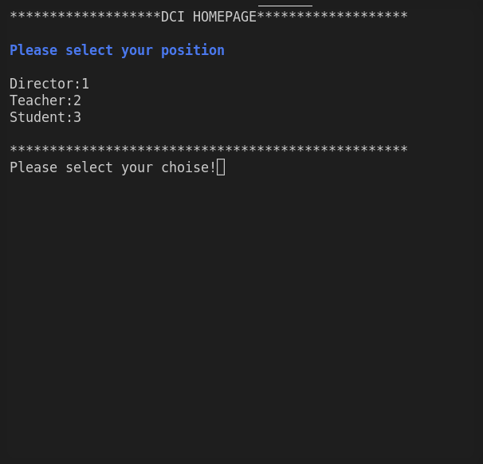

## JAVASCRIPT FINAL PROJECT - SCHOOL SYSTEM

## Table of Contents

- [General info](#general-info)
- [Preview](#preview)
- [Usage](#usage)
- [Technologies](#technologies)
- [Contact](#contact)

## General Info

This is a DCI end of chapter project. This project is an object oriented school system made using javascript programming language.

The project is designed as classes, functions, modules, states. In particular, its modular structure has made the codes reusable and made the system more understandable.

One of the important features of the project is to keep the system running continuously by catching possible error situations.

## Preview

### Desktop

### Tablet

### Mobile

## Usage

Information of some default characters for quick use:

### Director

Director Full Name : Maxim Mustermann   
Password           : 1236

### Teacher

Teacher Full Name  : Fabian Lehrermann \n
Password           : 1235

### Student

Student Full Name  : Ahmet Yanik
Password           : 1234

## Technologies

## Contact

Created by Ahmet Yanik - feel free to contact me for any inquiries!
